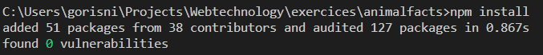
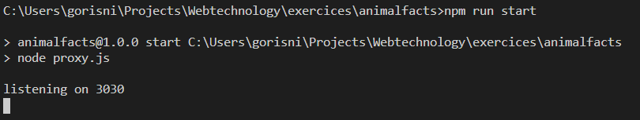

# Animal Facts
This will help you execute API calls to the [Cats API](https://alexwohlbruck.github.io/cat-facts/docs/).

## Installation
### Node.js
Please first install [Node.js](https://nodejs.org/en/), a tool to run JavaScript outside the browser.

### Node Package Manager
Use the package manager [npm](https://pip.pypa.io/en/stable/) to install.

```bash
npm install
```
Expected result:



## Usage
Execute the following command in your bash
```bash
npm run start
```
Expected result:



### Browser
Test in your browser if everything is running smoothly via following url: [http://localhost:3030/cats/random](http://localhost:3030/cats/random).
### JavaScript
Via Javascript you can use the following code for example.
```javascript
$.getJSON("http://localhost:3030/cats/random")
```

## License
[MIT](https://choosealicense.com/licenses/mit/)